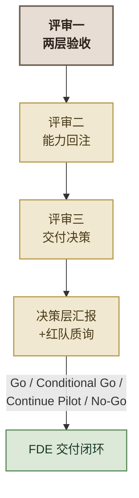

# 实验六：综合证据评审与决策层汇报

> 本材料为培训教学合成的虚构材料，企业与人员均为化名，条文与数值为教学示意，不对应任何真实机构、制度或业务数据；实务请以现行有效规定为准。
>
> **对应课纲：** FDE 综合实操 · 实验六（全团队 · 项目收尾）
> **时长：** 约 110 分钟
> **角色：** **Delta + Echo 全团队协作**——Echo 负责需求与价值侧验收，Delta 负责技术侧评估，全团队共同做证据评审、能力回注、交付决策与决策层汇报
> **模式：** 头脑风暴为主；**关键判断必须由团队完成**，AI 只能用于整理测试记录、汇总轨迹和扮演红队
> **核心隐喻：碎石路 → 铺装公路**。同时引入**交付决策（Go / Conditional Go / Continue Pilot / No-Go）**。
> **前置：** 已完成实验一至四及**实验五 · 综合系统 Agent（进阶）**（如选做），组内拥有：《解决方案框架》、三个单一场景 MVP（诉求分类／供电业务知识问答／工单分级路由工作流）、一个客户服务协同 Agent、每轮的《AGENTS.md》《retro.md》和验收报告

> **本手册与讲师版的区别：** 本手册是超集——除正文外，还含附录 F 分钟级时间表、附录 G 常见错误一句话点破、附录 H 第二层课后验收的组织方式。讲师版是同一内容的授课脚本（主持动作、点评要点、评分表、应急预案），供讲师现场使用；两者口径一致，如有不一致以本手册正文为准。

---

## 1. 实操概述

前几轮你们走完了一个完整的 FDE 交付闭环：

- **实验一（Echo）**：把"整套智能化"拆成三个子场景，定下技术路线和验收标准
- **实验二/三/四（Delta）**：做了三个单一场景 MVP——诉求分类（这是什么业务）、供电业务知识问答（依据是什么）、工单分级路由工作流（该谁办、要不要升级）
- **实验五 · 综合系统 Agent（进阶）**：把三种能力组织成一个能动态选工具、主动追问、人工暂停的协同 Agent

现在到了**收尾**。实验六**不做新功能**，而是基于全部证据做五件事：

1. **两层验收**：三个单一场景是否各自成立？协同 Agent 是否有业务闭环？
2. **FDE 化生产差距**：真实环境适配、业务动作闭环、客户接管、FDE 撤出
3. **能力回注**：哪些是"碎石路"、哪些能"铺装成公路"——覆盖工具、工作流、Agent 机制、业务语义四层
4. **交付决策**：分别对 A/B/C 和实验五 · 综合系统 Agent 给出 Go / Conditional Go / Continue Pilot / No-Go
5. **决策层汇报**：面向周主任／省公司数字化与网络安全部，讲清价值、风险、证据与下一步



*图 1：实验六的综合证据评审与决策汇报流程*

### 1.1 为什么关键判断不能交给 AI

和实验一一样——**实验六训练的是 FDE 的判断力、风险判断和最终表达，不是产出力。** 但和前面不同的是，实验六的问题（"需求满足了吗""能上生产吗""值不值得继续""哪些能力该回注"）**没有一个有标准答案，且都是基于证据的判断**。

因此实验六的 AI 边界分层：

- **AI 可以帮你**：整理测试记录、汇总 Agent 轨迹、把原始证据归类、扮演客户方红队质询、检查汇报结构、帮助匿名化表达。
- **人必须决定**：价值是否成立、风险能否接受、能否交付、什么值得回注、哪些数字可以对外承诺。

> 一句话：**AI 能帮你把证据整理得更清楚、把风险问得更尖锐，但"该不该继续、敢不敢交付"这最后一关，必须由你们自己拍板。**

### 1.2 本实操的两层验收结构（必须先读懂）

三层能力是在**不同时间点**完成和验收的，实验六必须按同一个口径分别处理：

| 层 | 范围 | 完成时间 | 验收时间 | 课上做什么 |
|---|---|---|---|---|
| **第一层** | 三个单一场景（A 诉求分类／B 供电业务知识问答／C 工单分级路由工作流） | 课上（实验二／三／四） | **当场验收** | 复跑验收命令，逐条对证据，判"是否满足／生产差距在哪" |
| **第二层** | 实验五 · 综合系统 Agent（进阶） | **课后**（课上只教机制与契约，不要求做完） | **课后完成后再验收** | 只做**对照讨论**："如果它做成了，判定标准是什么" |

> **课上的硬约束：** 第一层看证据，第二层看标准。**课上不得声称第二层已经验收通过**；第二层的签名与结论留到课后单独组织（组织方式见讲师版，学员按组内约定时间执行）。

课上以离线桩基线做对照，先看清"给定样本上最好能到什么程度"，再换各组自己的实现：

```
python 验收\evaluate.py --task all --impl stub     # 课上以离线桩基线做对照
python 验收\evaluate.py --task all --impl src      # 各组自己的实现
python 验收\evaluate.py --task all --impl api      # 在线模型（需 DEEPSEEK_API_KEY）
```

> 三条命令的区别只在被测实现：`stub` 是离线桩（无网络、确定性输出，用来做基线对照）；`src` 是各组自己的实现；`api` 是在线模型路径，**需 DEEPSEEK_API_KEY 环境变量已设置**（只检查"是否已设置"，不要回显它的值）。运行前先确认 `验收\evaluate.py` 在你们的工作目录下可按此路径解析到；若组内目录结构不同，**以实际路径为准，口径不变**。

---

## 2. 知识背景（四个脚手架 + 核心隐喻）

### 2.1 脚手架一：两层验收（三个场景 + 协同 Agent）

以前实验六做的是"双视角"（Echo 看需求、Delta 看生产）。纳入协同 Agent 后，升级为**两层验收**：

**第一层：三个业务场景各自是否成立**

| 对象 | Echo 关注（需求侧） | Delta 关注（技术侧） |
|---|---|---|
| A 诉求分类 | 是否减少错分和返工 | 当前样本是否足够、未知输入如何处理 |
| B 供电业务知识问答 | 是否降低答复答错的责任 | 来源是否真实、无证据是否拒答 |
| C 工单分级路由工作流 | 是否改善工单分流 | 固定分支是否执行、敏感件是否人工 |

**第二层：协同 Agent 综合能力是否成闭环**

| 检查项 | 核心问题 |
|---|---|
| 动态选择 | 是否真的按需选能力，而非固定 A→B→C |
| 观察与继续 | 工具结果不足时是否会继续判断 |
| 主动追问 | 用户补充后是否从原任务续跑 |
| 人工接管 | 敏感事项是否真实暂停 |
| 业务闭环 | 最终是否形成答复、草稿或人工接管状态 |
| 展示质量 | 非技术领导能否看懂任务状态和证据 |
| MVP 边界 | 是否诚实说明未完成的生产能力 |

### 2.2 脚手架二：FDE 化生产差距四问

承接前几轮的"六维差距表"（性能/可靠性/安全/合规/部署/数据），但把讨论主线聚焦到 FDE 真实关心的四件事：

```text
真实环境适配
→ 业务动作闭环
→ 客户责任与人工接管
→ FDE 撤出条件
```

1. 单一场景能力怎样接入客户真实数据和现有系统？
2. Agent 暂停后，由哪个客户岗位接管？
3. 电价与业务规则、专业条线职责和业务规则变化后，由谁维护？
4. FDE 离场后，客户团队能否继续运营？

### 2.3 脚手架三：能力回注四层（不止"代码"）

能力回注按四层判断，不只看代码能不能复用：

| 层次 | 回注内容 | 判断问题 |
|---|---|---|
| **内容** | 客户专属数据、知识和规则 | 是否换客户必须全换？（通常不回注） |
| **工具** | 分类、检索、查询、动作接口 | 接口契约能否跨项目复用？ |
| **Workflow/Agent 机制** | 路由、追问、人工暂停、停止条件 | 机制能否抽象成通用模式？ |
| **业务语义** | 对象、关系、状态、动作、治理 | 能否建成本体/领域模型？ |

**本体建模是本轮新增的一层。** 能力回注不只整理代码，还要判断能否抽象出：

- **对象**：客户诉求、政策条款、专业条线、服务工单、人工审核任务；
- **属性**：类别、状态、敏感等级、来源、责任部门；
- **关系**：诉求引用政策条款、工单分派部门、工单触发人工审核；
- **动作**：查询、分派、补证、升级、办结；
- **治理**：谁可查看、谁可执行、哪些动作必须人工批准。

> 对象、关系、动作与治理一体化的本体可以自建领域模型、知识图谱或业务语义层实现，不绑定任何特定厂商方案。能力回注的价值在于"抽象层是否成立"，不在于用了哪套技术。

### 2.4 脚手架四：交付决策四种状态

对每个场景和整体项目，采用四种交付决策：

| 决策 | 含义 |
|---|---|
| **Go** | 当前证据足够，可以进入下一阶段 |
| **Conditional Go** | 可以推进，但必须先满足明确条件 |
| **Continue Pilot** | 继续试点收集证据，暂不生产上线 |
| **No-Go** | 价值或风险不成立，停止或重新 Discovery |

> **不能因为页面漂亮就默认 Go。** 每项决策必须说明：当前决策、依据证据、剩余风险、补齐责任人、下一 Gate。

### 2.5 核心隐喻：碎石路 → 铺装公路

- **碎石路（非标定制）**：应急搭出的本地可用方案——**今天的三个单一场景 + 协同 Agent 就是"碎石路"**（部分是岭湾专属，做完就扔）。
- **铺装公路（平台固化）**：把可复用的模式、工具和机制反馈给平台团队，固化为标准能力——**明天其他客户都能用的"公路"**。

> 实验六的回注评审，就是判断：这些 demo 里，哪些只是碎石路，哪些抽象掉岭湾的壳之后，能铺装成公路惠及更多客户。

---

## 3. 课前准备

- [ ] 全组通读实验一的《解决方案框架》——尤其是三个子场景的需求定义、验收标准
- [ ] 全组回顾实验二/三/四和实验五的《AGENTS.md》和《retro.md》
- [ ] 全组回顾三个单一场景 MVP 验收报告 + 协同 Agent 的 QA 报告与轨迹证据
- [ ] 确认第一层验收命令可以在本组环境跑通（`stub` / `src` 两条先跑一次）
- [ ] 准备白板/大白纸、便签、马克笔；打印能力回注、交付决策、汇报结构模板（见附录）
- [ ] 可选的演示环境：客户服务协同 Agent 工作台已可启动，用于现场演示

> **协同 Agent 不是第四个业务场景，而是 A/B/C 三类能力的综合应用。** 最终评审：先判断三个场景是否各自成立，再判断它们是否被正确组织成完整业务闭环。

---

## 4. 评审一：两层验收——需求满足了吗？能上生产吗？（35 分钟）

> 全团队用两层视角审视。**先独立、后碰撞。**

### Step 1：独立判断（10 分钟）

**Echo 视角（需求/价值侧）：** 对每个单一场景 + 协同 Agent 各写一条判断——"它解决了当初定义的问题吗？✅/⚠️/❌，为什么？"

- 对照实验一的需求定义和验收标准。

**Delta 视角（技术/落地侧）：** 对每个单一场景 + 协同 Agent 各写一条——"它能上生产吗？差距在哪？"

- 从真实环境适配、业务动作闭环、客户接管、FDE 撤出四问想（不只六维表）。

> **FDE 灵魂追问：** 每个 demo 验收都达标了（分类自信区 ≥85% 且转人工 ≤30%、问答准确 ≥80% 且来源可追溯 ≥90%、路由 ≥90% 且敏感件零漏判、库外 2/2 拒答），协同 Agent 也跑通了 4 条开发任务——但**验收达标 = 需求满足吗？能上生产吗？** 尤其协同 Agent：4 条封闭任务跑通，不等于真实话务量与工单量下的所有诉求都能处理。

### Step 2：组内讨论（12 分钟）

把便签贴到白板，分两区：**需求满足度墙** + **生产差距墙**。

讨论：

1. **第一层对齐**：三个单一场景，为什么有人标 ✅、有人标 ⚠️？分歧在哪？
2. **第二层对齐**：协同 Agent 是不是真的动态选工具？还是把 A→B→C 固定走了一遍？它形成业务闭环了吗？
3. **Echo 与 Delta 互补**：需求侧发现的问题技术侧看到了吗？技术侧的工程差距需求侧关心吗？

> **FDE 灵魂追问：** 协同 Agent 的"动态选择、主动追问、人工暂停"——每一个都真的在代码/轨迹里成立了吗？还是只是界面看起来有？**界面漂亮 ≠ 生产可用。**

### Step 3：达成共识（13 分钟）

全组收敛成答题。**注意本轮模板已清空预填答案，请基于你们自己的产出一栏栏填。**

#### 输出物 1：两层验收表

> **同源提示：** 模板唯一权威为 `模板\两层验收表.md`；本表与之同源。

```markdown
# 两层验收表

## 第一层：三个单一场景
| 场景 | 当初的需求/验收标准 | 是否满足 | 生产差距 | 一句话理由 |
|------|------------------|---------|---------|-----------|
| A 诉求分类 | ________________ | ✅/⚠️/❌ | ________________ | ________________ |
| B 供电业务知识问答 | ________________ | ✅/⚠️/❌ | ________________ | ________________ |
| C 工单分级路由工作流 | ________________ | ✅/⚠️/❌ | ________________ | ________________ |

## 第二层：协同 Agent 综合能力（课后验收，课上只对标准）
| 检查项 | 判定标准是什么 | 课上对照结论 | 证据（课后补：指向哪条轨迹/报告） |
|--------|--------------|------------|------------------------------|
| 动态选择 | ________ | ________ | ________ |
| 观察与继续 | ________ | ________ | ________ |
| 主动追问 | ________ | ________ | ________ |
| 人工接管 | ________ | ________ | ________ |
| 业务闭环 | ________ | ________ | ________ |
| 展示质量 | ________ | ________ | ________ |
| MVP 边界诚实 | ________ | ________ | ________ |
```

#### 输出物 2：FDE 化生产差距表

```markdown
# 生产差距（FDE 四问）
| 对象 | 真实环境适配 | 业务动作闭环 | 客户责任/人工接管 | FDE 撤出条件 |
|------|------------|------------|----------------|------------|
| A 诉求分类 | ________ | ________ | ________ | ________ |
| B 供电业务知识问答 | ________ | ________ | ________ | ________ |
| C 工单分级路由 | ________ | ________ | ________ | ________ |
| 协同 Agent | ________ | ________ | ________ | ________ |

# 数据出域交代（必须单独列）
需求红线：数据不出信息内网。
我们的工程决策：____________________
（内网侧部署的模型选型、成本、工期 → ____________________）
```

**✅ 检查点：**

- [ ] 每人都写了独立判断便签
- [ ] 白板有两层验收墙 + 生产差距墙
- [ ] 讨论了至少 1 个"验收达标但需求没满足"的分歧
- [ ] 收敛成两层验收表 + FDE 化生产差距表（含数据出域交代）
- [ ] 明确写出"第二层留给课后验收"的判定标准，未在课上宣称已通过

### 4.1 讨论指引：评审一问题卡

> 下列问题是引导，不是考题。讨论卡住时对照展开。

**第一层（三个场景）：**

- **Q-A1 翻译检验**：150 字业务语言，向周主任讲清三个场景解决了什么痛点（禁技术词）
- **Q-A2 算账**：自信区 85% 准确率意味着仍有约 15% 的件不在自信区——它们该硬分还是拒答转人工？
- **Q-A3 生产差距**：测过真实话务量与工单量下的并发吗？方言和口语变体呢？电价与业务规则更新吗？路由工作流和协同 Agent 的差距各自是什么？

**第二层（协同 Agent 综合）：**

- **Q-B1 动态性**：哪一步证明它在按需选能力，而不是固定调用 A→B→C？
- **Q-B2 追问续跑**：用户补充后，它真的从原任务继续了吗？
- **Q-B3 人工接管**：敏感事项是"真暂停"还是只是叫打了"转人工"标签？

**全局：**

- **Q-C1 双视角冲突**：Echo 觉得满足、Delta 觉得还差得远——谁对？两种视角怎么互补？
- **Q-C2 红队挑战**：页面很漂亮、演示很顺，为什么仍可能是 Continue Pilot？

---

## 5. 评审二：能力回注——碎石路能铺成哪些公路？（30 分钟）

> 用"碎石路→铺装公路"隐喻 + 四层回注，判断每个 demo 哪些能沉淀成平台能力。

### Step 1：识别 + 抽象（15 分钟）

对四个对象（A/B/C/协同 Agent），逐项判断：它的能力，去掉"岭湾"的壳，剩下的是什么？

| 对象 | 客户特定实现（碎石路/内容） | 可回注能力（能铺路/机制） |
|------|--------------------------|------------------------|
| A 诉求分类 | ____________________ | ____________________ |
| B 供电业务知识问答 | ____________________ | ____________________ |
| C 工单分级路由工作流 | ____________________ | ____________________ |
| 协同 Agent | ____________________ | ____________________ |
| 贯穿 | ____________________ | ____________________ |

> **FDE 灵魂追问：** 判断标准——换个客户，这个东西要不要全换？要换＝内容（不回注），不用换＝机制（回注）。尤其协同 Agent：岭湾的协同流程是内容，但"受控 Agent 循环、主动澄清、人工暂停、统一工具契约"这些机制是能复用的。

### Step 2：四层回注（10 分钟）

对每个"能铺路"的候选，判断它属于哪一层、抽象成什么、在哪个第二场景验证：

```markdown
# 能力回注清单（四层）
| 候选 | 抽象后的通用能力 | 层次（内容/工具/机制/语义） | 第二场景 | 维护人 |
|------|----------------|--------------------------|---------|--------|
| ________ | ________ | ________ | ________ | ________ |
| ________ | ________ | ________ | ________ | ________ |

# 业务本体（可选，若课纲涉及）
对象：客户诉求 / 政策条款 / 专业条线 / 服务工单 / 人工审核任务
属性：类别 / 状态 / 敏感等级 / 来源 / 责任部门
关系：诉求→引用→政策条款；工单→分派→部门；工单→触发→人工审核
动作：查询 / 分派 / 补证 / 升级 / 办结
治理：谁可查看 / 谁可执行 / 哪些动作必须人工批准
```

> **FDE 灵魂追问：** "看起来通用"不等于能回注。每个候选都要答出：从哪个客户特定实现识别、去掉什么、抽象成什么、集成到哪、在哪个第二场景验证、谁维护。答不出这些，就不是真回注。

**✅ 检查点：**

- [ ] 四个对象（A/B/C/协同 Agent）都判断了碎石路/能铺路
- [ ] 识别出 ≥4 个回注候选，且至少覆盖工具/机制两层
- [ ] 每个候选有四层归属 + 第二场景验证
- [ ] （可选）讨论过业务本体建模

### 5.1 讨论指引：评审二问题卡

- **Q-D1 内容 vs 机制**：协同 Agent 里哪些是岭湾的内容（不回注）、哪些是能复用的机制（回注）？
- **Q-D2 工具契约**：分类、检索依据、查询职责归属三件接口，换个客户要全改吗？还是只用换数据？
- **Q-D3 Agent 机制**：受控 Agent 循环、主动澄清、人工暂停——这些是岭湾专属还是通用模式？
- **Q-D4 业务语义**：你的需求材料里，"客户诉求-政策条款-专业条线-服务工单-人工审核"这套关系，换一个供电服务客户是不是也成立？这能不能沉淀成一个本体/领域模型？
- **Q-D5 优先级**：只给一个团队资源，先铺哪条公路？为什么是它而不是别的？

---

## 6. 评审三：交付决策——Go / Conditional Go / Continue Pilot / No-Go（15 分钟）

> 这是实验六新增的、最"决策层"的一环。对每个对象 + 整体，给出明确的交付决策，**不能通篇 Go**。

### 6.1 逐项交付决策

```markdown
# 交付决策

## A 诉求分类：______（Go / Conditional Go / Continue Pilot / No-Go）
- 依据证据：______
- 剩余风险：______
- 补齐责任人：______
- 下一 Gate：______

## B 供电业务知识问答：______
- 依据证据：______
- 剩余风险：______
- 补齐责任人：______
- 下一 Gate：______

## C 工单分级路由工作流：______
- 依据证据：______
- 剩余风险：______
- 补齐责任人：______
- 下一 Gate：______

## 综合系统 Agent（实验五）：______
- 依据证据：______
- 剩余风险：______
- 补齐责任人：______
- 下一 Gate：______

## 整体：______
- 依据证据：______
- 剩余风险：______
- 补齐责任人：______
- 下一 Gate：______
```

> **FDE 灵魂追问：** 什么证据出现，会让你把某一项从 Go 改成 No-Go？如果答不上来，说明你的"Go"只是表态，没有风险边界。**页面很漂亮、演示很顺，为什么仍可能是 Continue Pilot？**

**✅ 检查点：**

- [ ] 四项 + 整体都给了明确决策
- [ ] 每项都有"依据证据 / 剩余风险 / 补齐责任人 / 下一 Gate"
- [ ] 至少讨论过"什么证据会让某一项变 No-Go"
- [ ] 没有因为界面漂亮就全部默认 Go
- [ ] 协同 Agent 一栏的决策写明"待课后验收补齐证据"，没有拿课上标准当验收结论

---

## 7. 决策层汇报与质询（25 分钟）

> 面向周主任（决策层）和省公司数字化与网络安全部（监管层）。汇报不是"我们做了什么"，而是"**我们解决了你什么问题、值不值、该不该继续**"。

### 7.1 汇报结构（10 段，金字塔提升版）

```text
第 1 页  封面：岭湾电力客户服务平台 AI 阶段交付与决策汇报
第 2 页  结论：三个场景与协同 Agent 的当前决策
第 3 页  场景 A：诉求分类能力及证据
第 4 页  场景 B：供电业务知识问答的证据及可追溯性
第 5 页  场景 C：工单分级路由与敏感件边界
第 6 页  协同 Agent：现场演示
第 7 页  人机边界：主动追问、人工暂停与客户接管
第 8 页  合规与真实环境约束
第 9 页  能力回注与业务本体
第 10 页 下一步：Go / Conditional Go / Continue Pilot / No-Go 请求
```

> **与《收口汇报十页骨架》的关系：** 那份十页骨架是同一个汇报的通用底稿（结论先行、双线汇报、ROI 与常见追问）；本 10 段结构是它在实验六这一轮的展开版，**本实验以本 10 段结构为准**，页序与请求位置以十页骨架的纪律为准。

### 7.2 协同 Agent 现场演示（至少两条轨迹）

1. **政策问题**：按需调用供电业务知识问答能力并提供来源；
2. **信息不足或敏感事项**：主动追问或暂停人工。

如时间允许：3. 专业条线查询并形成工单草稿（草稿 `submitted` 恒为 false，绝不真提交）。

演示时必须说明：

- 为什么没有固定调用全部工具；
- 为什么某个任务交还给人；
- 当前只是 MVP，不覆盖生产所有诉求；
- 哪些能力需要进入下一阶段。

### 7.3 汇报语言要求

- 全业务语言，有数字、有 ROI 框架（不给编的数字）；
- 对周主任讲价值、对省公司数字化与网络安全部讲合规（两套话术）；
- 主动交代数据出域 + 演示/生产分界；
- 明确给出决策级结论（不是"我们做了三个 demo"）。

**✅ 检查点：**

- [ ] 金字塔 + 10 段结构汇报
- [ ] 协同 Agent 现场演示至少两条轨迹
- [ ] 讲清"为什么没固定调全部工具""为什么某任务交还给人"
- [ ] 有 ROI 框架（不给编的数字），两套话术分清
- [ ] 有明确交付决策（Go/Conditional Go/Continue Pilot/No-Go）

### 7.4 讨论指引：评审四问题卡

- **Q-E1 快赢**（扮周主任）：先上哪个？什么时候见效？
- **Q-E2 追责**（扮省公司数字化与网络安全部）：出了数据泄露谁负责？怎么降险？
- **Q-E3 失业**（扮小林）：AI 会不会让我失业？"机器干重复的，人干判断的"怎么讲？
- **Q-E4 接管**：协同 Agent 暂停后由哪个客户岗位接管？真人能不能操作？
- **Q-E5 撤出**：FDE 撤出后，谁维护电价与业务规则、专业条线职责和业务规则？

---

## 8. 完成标准（DoD）

- [ ] **评审一（两层验收）**：三个单一场景 + 协同 Agent 分层验收表、FDE 化生产差距表（含数据出域交代）完成
- [ ] **评审二（能力回注）**：四个对象碎石路/能铺路判断 + ≥4 回注候选 + 四层归属 + 第二场景
- [ ] **评审三（交付决策）**：A/B/C/协同 Agent/整体五项决策，每项有四要素（证据/风险/责任人/下一 Gate）
- [ ] **评审四（决策层汇报）**：10 段结构 + 协同 Agent 现场演示至少两条轨迹，有 ROI + 合规交代
- [ ] **两层验收时间口径正确**：第一层当场验收，第二层写明"课后完成后再验收"的判定标准
- [ ] **Workflow vs Agent 辨析**：能说清实验四（固定路由）与协同 Agent（受控 Agent）的区别
- [ ] **能力回注多层级**：回注覆盖工具、Workflow/Agent 机制、业务语义（不仅是代码）
- [ ] **人工接管责任**：谁在客户侧接管、FDE 撤出条件已讨论
- [ ] **关键判断由团队作出**：AI 只用于证据整理/红队挑战，不替团队下结论
- [ ] **AI 使用边界**：价值/风险/回注/是否继续的最终判断由人完成

---

## 9. 交付物清单

```
实验六-综合评审/
├── 两层验收表.md            # 三个单一场景 + 协同 Agent 分层验收（含数据出域交代）
├── 生产差距表.md             # FDE 四问（真实环境/闭环/接管/撤出）
├── 能力回注清单.md           # 四层（内容/工具/机制/语义）+ 业务本体
├── 交付决策.md               # 五项（A/B/C/协同 Agent/整体）Go/Conditional Go/Continue Pilot/No-Go
├── 决策层汇报稿.md           # 10 段结构汇报
└── 协同 Agent 演示轨迹记录.md # 至少两条轨迹（政策问答 + 追问/敏感）
```

> **★ 能力回注 + 交付决策** 是本实操最重要的两个产出：前者看出你能否"从项目定制到平台资产"地升华，后者看出你能否用证据做"该不该继续"的决策——这是 FDE 区别于"外包交付"的核心。

---

## 附录 A：能力回注四步法模板

> **同源提示：** 模板唯一权威为 `模板\能力回注清单.md`；本附录与之同源。

```markdown
# 能力回注 · 候选评估

## 候选：______（来源：______）

### 1. 识别（碎石路，还是能铺路？）
- 客户特定实现（碎石路）：______
- 可能复用场景（能铺路给谁）：______
- 内容 or 机制：______

### 2. 抽象（去掉客户特定，泛化为通用）
- 抽象后的通用能力：______
- 去掉了哪些客户特定逻辑：______
- 可配置参数/接口：______

### 3. 四层归属
- 层次（内容/工具/机制/业务语义）：______

### 4. 验证（第二场景）+ 维护
- 在哪个第二场景验证：______
- 谁负责维护：______
```

## 附录 B：交付决策模板

> **同源提示：** 模板唯一权威为 `模板\交付决策单.md`；本附录与之同源。

```markdown
## 场景/对象：______
- 当前决策：Go / Conditional Go / Continue Pilot / No-Go
- 依据证据：______
- 剩余风险：______
- 补齐责任人：______
- 下一 Gate：______
```

## 附录 C：决策层汇报结构模板

> **同源提示：** 模板唯一权威为 `模板\决策层汇报结构.md`；本附录与之同源。

```markdown
1. 封面：岭湾电力客户服务平台 AI 阶段交付与决策汇报
2. 结论（三个场景 + 协同 Agent 的当前决策）
3. 场景 A：诉求分类能力及证据
4. 场景 B：供电业务知识问答的证据及可追溯性
5. 场景 C：工单分级路由与敏感件边界
6. 协同 Agent：现场演示
7. 人机边界：主动追问、人工暂停与客户接管
8. 合规与真实环境约束
9. 能力回注与业务本体
10. 下一步：交付决策请求
```

## 附录 D：FDE 灵魂追问汇总

| # | 环节 | 追问 |
|---|------|------|
| 1 | 评审一 | 验收达标 = 需求满足吗？协同 Agent 4 条封闭任务跑通等于能上生产吗？ |
| 2 | 评审一 | 界面漂亮 = 生产可用吗？动态/追问/人工暂停在代码里真的成立吗？ |
| 3 | 评审二 | 去掉岭湾的壳，协同 Agent 里哪些是内容、哪些是通用机制？ |
| 4 | 评审二 | "看起来通用"能回注吗？在哪个第二场景验证、谁维护？ |
| 5 | 评审三 | 什么证据变，会让某一项从 Go 改成 No-Go？ |
| 6 | 评审三 | 通篇 Go 说明什么？没有风险边界的决策不是决策。 |
| 7 | 评审四 | 对周主任和省公司数字化与网络安全部，话术能一样吗？ |
| 8 | 评审四 | ROI 为什么只能给框架、不能给编的数字？接管与撤出谁负责？ |

## 附录 E：讲师引导要点

- **两层验收是核心**：先看三个单一场景是否各自成立，再看协同 Agent 是否有业务闭环。讲师要确认学员没把"协同 Agent 漂亮界面"当"生产可用证据"。
- **两层时间口径不能混**：第一层当场验收；第二层课上只对标准、课后完成后再验收。学员若在课上宣布"第二层也过了"，要立刻纠正。
- **Workflow vs Agent 辨析**：学员若说不清实验四为什么是固定 Workflow、协同 Agent 为什么是受控 Agent，说明概念没有真正迁移。
- **交付决策必须给风险边界**：通篇 Go 要追问"什么证据会改成 No-Go"。页面好看不等于能交付。
- **能力回注分四层**：学员容易只整理代码。引导看工具契约、Agent 机制、业务语义是否能跨项目复用。
- **AI 边界**：价值/风险/回注/是否继续的最终判断必须由团队作出；AI 只能整理证据或当红队。

## 附录 F：110 分钟分钟级时间表

> 本表是主持本轮评审时的时间底稿。小组内部先完成 1–4 个评审段，收口汇报按最后一段的节奏走。

| 时间段 | 分钟 | 环节 | 学员产出 | 交作业点 |
|---|---:|---|---|---|
| 00:00–00:05 | 5 | 开场定调 + 两层验收口径交底 | 明确本轮只做判断、不做新功能 | — |
| 00:05–00:15 | 10 | 评审一 Step 1 独立判断 | 每人 ≥4 张独立判断便签 | — |
| 00:15–00:27 | 12 | 评审一 Step 2 组内讨论 | 需求满足度墙 + 生产差距墙 | — |
| 00:27–00:40 | 13 | 评审一 Step 3 达成共识（含现场复跑验收命令） | 两层验收表 + FDE 化生产差距表 | **评审一产出** |
| 00:40–00:55 | 15 | 评审二 Step 1 识别 + 抽象 | 四个对象碎石路/能铺路判断表 | — |
| 00:55–01:05 | 10 | 评审二 Step 2 四层回注 | 能力回注清单 | **评审二产出** |
| 01:05–01:20 | 15 | 评审三 交付决策 | 五项决策，每项四要素 | **评审三产出** |
| 01:20–01:30 | 10 | 评审四 汇报准备 + 协同 Agent 演示筹备 | 10 段汇报稿骨架 + 演示脚本 | — |
| 01:30–01:50 | 20 | 评审四 汇报 + 质询（每组 5 分钟：讲 3 + 问 2） | 汇报 + 现场应答记录 | **评审四产出** |
| 01:50–01:55 | 5 | 收口与课后验收布置 | 组内约定课后验收时间 | 全部产出物回收 |

> **时间不够时的取舍顺序（从先舍到后舍）：** 1. 协同 Agent 第三条演示轨迹（专业条线查询与工单草稿）；2. 评审二的本体建模讨论；3. 汇报组数（改抽 2 组，其余交稿不现场讲）。**无论怎么压缩，第一层的验收复跑、评审三的"什么证据会变 No-Go"、第二层的时间口径交底三者不能省。**

## 附录 G：常见错误一句话点破（自查用）

| 常见错误 | 一句话点破 |
|---|---|
| 把"验收达标"当成"需求满足" | "样本上达标，是**这套样本**上达标——真实话务量与工单量下的错派率你们算得出来吗？" |
| 把协同 Agent 的漂亮界面当生产可用证据 | "界面演示得顺，和生产能接管，是两件事。" |
| 用"转人工"当挡箭牌 | "转人工不是免责——接收队列、负责人、时限、可回写、未处理告警，这七项缺一项它就是个标签。" |
| 课上直接宣布第二层通过 | "第二层还没做完，你们现在验收的是空气。" |
| 生产差距墙空着 | "空着的那面墙，恰恰是客户明天会问你的那部分。" |
| 只写"沉淀了方法论" | "拿不出东西的沉淀，等于没沉淀。" |
| 把岭湾的专属口径当通用件回注 | "把五类口径和六条职责说法带走，等于把别人的家规当国标。" |
| 通篇 Go | "什么证据出现，会让你把某一项从 Go 改成 No-Go？答不上来，你的 Go 只是态度。" |
| 决策里没有责任人 | "没有人名的责任人，等于没有人负责。" |
| 汇报讲成技术秀 | "周主任关心的是派单少错、答复有依据、坐席不背锅，不是你们用了几个模型。" |
| 对监管层大讲 ROI | "他关心的是边界在哪、什么还没证明——讲价值等于答非所问。" |
| 只说"数据安全我们很重视" | "把数据从哪来、到哪去、谁签字说清楚，比表态有用。" |
| 请求写得太虚 | "'请多支持'不是请求，'请批两周窄试点范围、指定一名口径确认人'才是。" |

## 附录 H：第二层课后验收的组织方式（必读）

### H.1 谁来组织、什么时间

- **组织者**：本组 Delta 位牵头提交，Echo 位复核判断，**讲师（或讲师指定的组外复核人）验收**。
- **时间**：课后由各组自行完成实验五，**完成后向讲师报备验收时间**；建议在下一模块开课前完成，逾期不补的组，第二层结论计为"未验收"，不影响第一层与整体 DoD。
- **验收形式**：15 分钟/组；**必须现场复跑，不接受只交截图**。

### H.2 提交物（四项，缺一项不予验收）

1. 协同 Agent 的**运行轨迹记录**（至少两条：政策问答类 + 追问或敏感转人类）；
2. **QA 报告**（含命中敏感件**真暂停**的证据：`interrupted = true` 之后不再继续自动流程）；
3. **两层验收表第二层的完整填写版**（七项检查项逐项给证据指向）；
4. **交付决策单里"协同 Agent"那一栏的更新版**（依据证据补齐后重新给定决策）。

### H.3 逐项判定标准（照此打勾）

| 检查项 | 判定标准（必须能在提交物里指到具体位置） |
|---|---|
| 动态选择 | 轨迹里能看到"按需调用"，而非每次都固定走 A→B→C；有一步是因为不需要而未调用 |
| 观察与继续 | 工具返回不足时，能看到它继续判断或换路，而不是直接给答案 |
| 主动追问 | 信息不足时提一个澄清问题（**一次只问最关键的一个**），补充后**从原任务续跑** |
| 人工接管 | 命中敏感清单的件**真暂停**：`request_human_review` 返回 `interrupted: true` 后不再产出答复或草稿；人工三选一（批准草稿／要求补充／终止自动处理）后才继续 |
| 业务闭环 | 最终形成一个明确状态：答复（带 `evidence[]`）／工单草稿（`submitted` 恒为 false）／人工接管 |
| 展示质量 | 非技术听众能看懂当前任务状态与证据来源（不用讲师解释也能读懂） |
| MVP 边界诚实 | 主动写明未覆盖的生产能力（真实话务量与工单量、方言口语变体、知识版本台账、真实系统对接） |

### H.4 复跑命令与口径

```
python 验收\evaluate.py --task all --impl stub     # 课上以离线桩基线做对照
python 验收\evaluate.py --task all --impl src      # 各组自己的实现
python 验收\evaluate.py --task all --impl api      # 在线模型（需 DEEPSEEK_API_KEY）
```

- 课后验收**先跑 `src`**；结果异常时用 `stub` 做对照（判定"是你们的实现问题还是环境问题"）；
- 需要在线路径时跑 `api`，**只检查 `DEEPSEEK_API_KEY` 是否已设置，绝不回显其值**；
- **样本外部给定、不得重造**——改了样本，第二层结论同样作废。

### H.5 判定与反馈

- **通过**：七项里除"人工接管"与"业务闭环"外的项目允许一项标"⚠️ 部分成立"，但**人工接管与业务闭环两项必须成立**；
- **不通过**：常见两种——第一种是"假暂停"（打印一句已转人工后仍把答复或草稿生成了）；第二种是动态选择实为固定流水线。**这两种一律不合格，给一次整改机会**；
- **结果回填**：验收结论回填到《两层验收表》第二层与《交付决策单》"协同 Agent"栏，作为整体决策的依据之一。

---

## 最终提醒

> 实验六以前叫"三个 demo 的总结"，现在升级为**综合证据评审与决策层汇报**。它考的从来不是"你做了几个功能"，而是：
> **你能否用证据回答——这个问题值不值得继续做，能不能交付，什么值得回注回平台。**
>
> 这也正是 FDE 交付的最后一公里：**把"做出来了"变成"该不该继续、客户能不能接管、什么能沉淀成平台资产"。**
