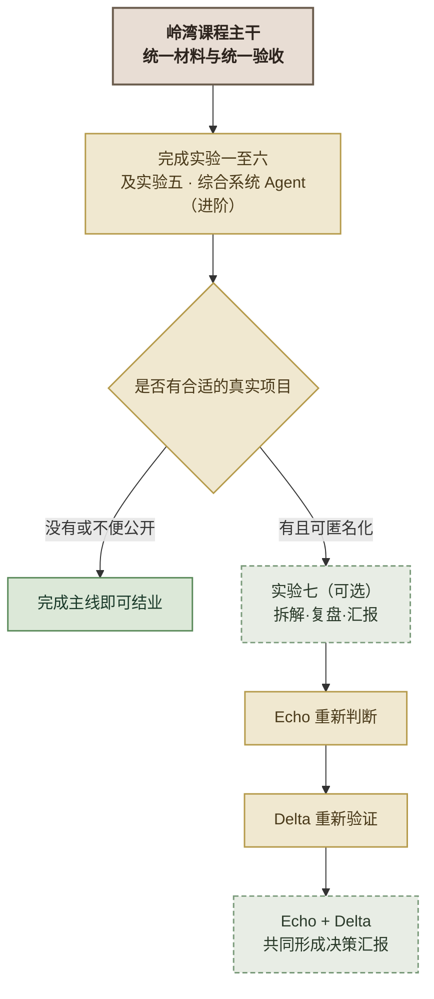

# 实验七：复盘真实项目（学员版）

> 本材料为培训教学合成的虚构材料，企业与人员均为化名，条文与数值为教学示意，不对应任何真实机构、制度或业务数据；实务请以现行有效规定为准。
>
> **实验性质：** 课程结束后的**可选、独立**迁移挑战。它不属于必修内容，也不影响结业。
> **一句话目标：** 把你在岭湾课程主线里学会的 FDE 理念、流程和判断框架，迁移到你自己的**真实项目**上，完成拆解、复盘与决策层汇报。
> **角色：** 仅使用 **Echo**（主责判断：挖真问题、拆场景、判断价值）和 **Delta**（主责施工：验证技术、评估落地、守住边界）。不新增任何第三种 FDE 角色。
> **建议时长：** 课前准备 + 约 3 小时（含汇报与质询）。
> **完成前提：** 已学完实验一～实验六（其中实验五 · 综合系统 Agent（进阶）可后置）。真实项目可按需匿名化。
> **核心原则：框架不变，项目换成你自己的工作。** 岭湾是给全班统一的练习；这份附加实验，是检验你能否把方法带回真实世界。

---

## 1. 实验概述

五个主线实操用**岭湾电力客户服务平台**这个统一虚构案例，完成了系统性的方法训练。它承担：统一客户背景、统一需求材料、统一 A/B/C 三个场景、统一诉求分类/供电业务知识问答/工单分级路由工作流/协同 Agent 的能力递进、统一 Echo/Delta 分工、统一验收口径、统一实验六收口。

这份可选实验，是课程主干之外的**可选挑战**：

- **没有合适真实项目的学员**：完成主线即可达到课程基本要求，不参加本实验不影响结业。
- **有合适真实项目的学员**：选择本人一个真实业务项目，撤下"岭湾"这个统一壳，把同一套方法用一遍。



*图 1：课程主干与实验七的关系*

### 1.1 本实验做什么、不做什么

**做什么：**

- 用 FDE 方法**重新拆解**你的真实项目（找对问题、拆场景、选技术路线）；
- 用 Echo/Delta 双视角**复盘**它当前处于什么阶段、验证了什么、还缺什么证据；
- 和同伴一起，为项目做出**明确的下一阶段决策**，并完成一次**决策层汇报**。

**不做什么：**

- **不强制重新开发一个 AI 系统**，也不强制真实项目使用 Agent；
- 不教授新的 FDE 方法——它只检验迁移；
- 不必是"又一个 AI 项目"——它检验的是**换一个项目，你是否仍能找对问题、判断取舍**。

### 1.2 为什么这次是你自己动手

岭湾统一案例是"别人设计好的练习"——需求、干系人、坑都预先埋好，讲师知道答案。真实项目**没有标准答案**：你的客户、你的问题、你的证据、你的判断，只有你自己能负责。这正是迁移的价值所在。

> **AI 可以用，但关键判断必须是你（Echo/Delta）自己下。** AI 可以帮你整理材料、归类证据、扮演红队质询；但"客户真正的问题是什么""这个风险能不能接受""值不值得继续投"——这些决定了项目成败，AI 替不了你。

---

## 2. 本轮核心学习点：把方法从"案例"迁移到"真实世界"

主线实操教你的是**在给定案例里做对一件事**；这份迁移实验，训练的是你能不能在**没有标准答案的环境里，仍用同一套方法自律地做完一件事**。

具体要检验的迁移能力：

| 主线哪里学 | 迁移到哪里 |
|---|---|
| 实验一：Echo 读客户材料 | 整理你的真实项目材料和原始需求 |
| 四类失败模式 | 检查真实项目的数据、业务、合规、ROI 风险 |
| 四层决策链 | 识别你客户的决策层/操作层/技术层/监管层 |
| 能力金字塔选型 | 判断你的项目该用 Prompt/分类/RAG/Workflow/Agent/微调/不用 AI |
| 实验二/三/四：三个单一场景 MVP | 判断你的项目需不需要这几个能力 |
| 实验五 · 综合系统 Agent（进阶） | 判断你的项目是否真的需要动态选工具、追问、人工暂停 |
| 实验六：两层验收收口 | 由 Echo/Delta 共同给出下一阶段决策和汇报 |

> **记住这条主线：** 先用单一场景 MVP 学会能力积木，再用协同 Agent 学会动态协同，最后由全团队判断能否交付、怎样接管、什么值得回注。这份迁移实验，是把"最后这一步"放到你自己的项目上再做一次。

---

## 3. 课前准备：项目准入与匿名化

### 3.1 你的真实项目准入 Gate

选一个真实项目，至少满足：

- [ ] 有明确的外部客户或内部被服务部门；
- [ ] 有一个真实发生的业务问题（不是"想做一个 AI 功能"）；
- [ ] 能描述当前业务流程或项目现状；
- [ ] 至少有一项真实且可匿名化的证据；
- [ ] 可以在不泄密的前提下完成汇报。

如果项目不满足，你有四种处理方式：

| 状态 | 处理方式 |
|---|---|
| 项目范围过大 | 缩小到一个可验证子场景 |
| 材料不足 | 标为"项目构想"，重点设计验证计划，不声称已验证 |
| 无法公开 | 深度匿名化，或不参加本实验 |
| 没有本人项目 | 不参加，不影响主线结业 |

### 3.2 至少提供一项真实证据

可选证据（至少一项）：

- 匿名化的需求材料；
- 用户/客户访谈摘要；
- 当前业务流程图；
- 脱敏样本；
- 原型运行结果；
- 测试或 QA 记录；
- 用户试用反馈；
- 项目失败记录；
- 客户确认的业务基线；
- 版本演进和修改记录。

> **红线：** 如果没有任何真实证据，只能把项目标为"项目构想"，**不得声称已经完成真实验证**。

### 3.3 证据状态标记

所有信息按以下四类标记，写入你的记录：

| 证据状态 | 定义 |
|---|---|
| **已实测** | 有运行结果、数据或用户行为支持 |
| **客户确认** | 已由客户或业务负责人明确确认 |
| **当前假设** | 目前合理，但尚未得到验证 |
| **待获取** | 当前缺少关键资料或数据 |

> 复盘最容易翻车的地方，是把"当前假设"写成"已实测"。全程只要区分不清楚，你的汇报就会被质询打穿。

### 3.4 保密纪律

**允许匿名化：** 客户名称、人员姓名、城市/组织/部门名称、系统名称、金额和业务数量、接口和环境信息。

**禁止展示：** API Key、密码和 Token、客户生产数据、身份证号/手机号等个人信息、未公开合同、内部网络拓扑、未经授权的源码和日志、可以组合识别客户的敏感信息。

建议统一声明：

> 本案例依据真实项目改编，客户名称和业务数据已经匿名化；结论仅覆盖课程期间取得的证据范围。

### 3.5 准备工具

- 白板/大白纸、便签、马克笔（和主线头脑风暴实验一致）；
- 打印附录模板：真实项目解决方案框架、双视角复盘表、能力回注模板、决策层汇报结构；
- 你的真实项目材料（已匿名化）；
- 可选：AI 工具（仅用于整理材料、归类证据、扮演红队，不用于做最终判断）。

---

## 4. Echo 重走 Discovery（约 60 分钟）——主责判断，断清"问题是什么"

> 这一部分由 **Echo** 主导。目标不是"描述你的项目现状"，而是**像实验一那样，从一堆模糊材料里挖出真正值得做的问题**。

### Step 1：整理项目事实底账（15 分钟）

回答七个问题，写成一页事实底账：

1. 客户或内部被服务部门是谁？
2. 客户最初怎样表达需求？（原始原话）
3. 当前业务流程是什么？
4. 已有系统或原型是什么？
5. 当前已掌握哪些数据？
6. 已经发生过哪些成功、失败或停滞？
7. 哪些信息属于**事实**，哪些只是**判断**？

> 事实底账是后面一切的锚。如果"判断"和"事实"混在一起，你的场景拆解和技术选型都会建在流沙上。

### Step 2：用四类失败模式挖风险（10 分钟）

完全复用实验一的脚手架：

| 失败模式 | 真实项目检查问题 |
|---|---|
| **数据不可用** | 数据是否存在、可取、够用、可合法使用？ |
| **业务不配合** | 真正使用者是否愿意改变原有流程？ |
| **合规卡住** | 数据、模型和业务动作有哪些红线？ |
| **ROI 说不清** | 业务基线是否真实，价值怎样验证？ |

> **FDE 灵魂追问：** 你的项目里，哪一类失败模式最致命？客户不会主动告诉你——你得自己读出来。如果这四项你随随便便就打勾，说明你还没真正碰过这个项目。

### Step 3：用四层决策链理干系人（10 分钟）

四层是**客户侧干系人**，不是新增 FDE 角色：

| 客户干系人 | Echo 需要判断 |
|---|---|
| 决策层 | 为什么支持这个项目？依据什么批准？ |
| 操作层 | 谁每天使用？谁可能抵触？ |
| 技术层 | 谁提供数据、接口和环境？ |
| 监管层 | 谁可以叫停项目？需要什么证据？ |

### Step 4：区分三类问题（10 分钟）

```text
客户提出的功能
≠ 客户真正要解决的问题
≠ 项目最终应该交付的能力
```

Echo 必须写清：

- 客户的**表面需求**是什么？
- 你重新识别的**真实问题**是什么？
- 为什么原表述可能导致错误的施工？
- 哪项业务变化，才算这个项目成功？

> **FDE 灵魂追问：** 客户说"我要个 AI"，你不用急着替他定义"AI"。先问：他真正想解决的业务变化是什么？如果不用 AI 也能降低那个数字，AI 就不是必须的。

### Step 5：拆场景与选技术（15 分钟）

把真实问题拆成若干可验证子场景，每个子场景至少回答：

| 判断项 | 内容 |
|---|---|
| 业务目标 | 该场景需要改变什么业务结果（不是"实现某功能"） |
| 使用者 | 谁会使用或受影响 |
| 输入输出 | 系统接收什么，产生什么 |
| 最小方案 | 不用复杂 AI 能否解决？ |
| 技术路线 | Prompt / 分类 / RAG / Workflow / Agent / 微调 / 不用 AI |
| 人工边界 | 哪些判断必须交给人 |
| 验收证据 | 怎样证明方案有效 |
| 不做范围 | 当前明确不解决什么 |

技术路线继续遵循课程逻辑：

```text
一次调用可以解决           → Prompt 或分类
必须查询资料并提供来源     → RAG
路径稳定、规则可以预先枚举 → Workflow
需要根据中间结果追问/选工具/调整下一步 → Agent
需要改变模型稳定行为且数据充分 → 再评估微调
```

每个子场景必须回答三件事：

1. 为什么选这个方案？
2. 为什么不用更复杂的方案？
3. 如果**不用 AI**，是否反而更合适？

### Step 6：产出——Echo 阶段解决方案框架

复用实验一的《解决方案框架》，为每个场景增加证据状态：

| 场景 | 真实问题 | 使用者 | 技术路线 | 当前证据 | 最小验证 | 风险 | 优先级 |
|---|---|---|---|---|---|---|---|

> 这份框架不是"你打算做什么"，而是"你认为该做什么、凭什么"。证据那一列会让真相浮出来。

---

## 5. Delta 重审 Prototype、Build 与 Scale（约 60 分钟）——主责施工，验清"能不能落地"

> 这一部分由 **Delta** 主导。目标是把 Echo 的判断拿到工程与现场现实中检验：这个方案真的成立吗？能和客户真实环境接得上吗？

### Step 1：判断项目当前阶段（10 分钟）

先确定项目实际处于哪个阶段：

- Discovery（发现期）
- Prototype（原型期）
- Build（构建期）
- Scale（规模化）

> **判断不能只看是否已有代码或页面：**
> ```text
> 有代码 ≠ 已证明原型价值
> 有页面 ≠ 已进入 Build
> 已经上线 ≠ 客户能够接管
> ```

### Step 2：按方案类型检查原型证据（15 分钟）

如果你 Echo 阶段选的技术路线是分类/RAG/Workflow/Agent，逐类检查你的落地证据：

**分类项目：**

- 输入和类别是否明确？
- 是否有外部给定的样本？
- 拿不准时是否转人工？
- 准确率是否只代表当前样本？
- 一次调用是否已经足够？

**RAG 项目：**

- 文档从哪里来？
- 回答是否有来源？
- 没有证据时是否拒答？
- 知识更新后如何处理？
- 验收是否同时检查答案和来源？

**Workflow 项目：**

- 路径是否稳定、可以枚举？
- 分支动作是否实际执行？
- 是否错误包装成了 Agent？
- 哪些边界必须人工接管？

**Agent 项目：**

- 是否根据状态按需选择工具？
- 是否观察工具结果？
- 信息不足时是否追问？
- 高风险时是否暂停？
- 是否有停止条件？
- 是否其实用 Workflow 就足够？

> **FDE 灵魂追问：** 很多项目把"分类后调了个工具"叫做 Agent。这个项目是不是也只用了固定 Workflow，却在 PPT 里写成了"智能体"？诚实一点——这决定了你的边界判断是否成立。

### Step 3：尚无原型时的最小验证设计（15 分钟）

如果你项目还没有原型，不要求重新开发完整系统，但至少说明一套最小验证方案：

```text
输入是什么
→ 使用哪种最小技术
→ 输出是什么
→ 使用什么外部给定样本
→ 怎样验收
→ 什么情况转人工或判定失败
```

### Step 4：从 Prototype 到客户环境（20 分钟）

保持 FDE 落地角度，不展开为通用 DevOps/SRE 清单：

- 原型假设在真实现场是否成立？
- 演示数据与真实数据有什么差异？
- 输出怎样进入现有业务流程？
- 是否触发真实业务动作？
- 人工兜底由谁接？
- 状态如何回写到客户系统？
- 客户侧负责人是谁？
- 业务规则和知识由谁维护？
- FDE 离场后客户能否继续运营？
- 达到什么条件后 FDE 可以撤出？

> **FDE 灵魂追问：** 你的项目做完交出去，客户团队能不能自己用、自己维护、自己判断？如果答案是"只有你的电脑能跑"，你就还没有完成 FDE 的交付。

### Step 5：产出——Delta 阶段复盘表

| 场景 | 当前阶段 | 已验证证据 | 未验证假设 | 真实环境差距 | 人工接管 | 下一 Gate |
|---|---|---|---|---|---|---|

---

## 6. Echo + Delta 双视角收口（约 30 分钟）——合起来，形成团队判断

> 这一部分由 **Echo + Delta 共同**完成。你的判断和她的验证，合起来才是完整交付判断。

### Step 1：双视角验收

| 视角 | 判断内容 |
|---|---|
| **Echo** | 问题是否找对、价值是否成立、组织是否愿意采用 |
| **Delta** | 原型是否成立、能否进入真实环境、客户能否接管 |
| **Echo + Delta** | 是否值得进入下一阶段，以及需要满足什么条件 |

### Step 2：能力回注

继续使用统一四步法：**识别 → 抽象 → 集成 → 验证**。

分工：Echo 判断业务上是否具有跨客户价值；Delta 判断技术上可否配置化、复用和维护；两者共同决定是否值得回注。

能力回注分四层：

| 层次 | 回注内容 |
|---|---|
| 内容 | 客户专属数据、知识和规则，通常不直接回注 |
| 工具 | 分类、检索、查询和动作接口 |
| Workflow / Agent 机制 | 路由、追问、人工暂停和停止条件 |
| 业务语义 | 对象、关系、状态、动作和治理约束 |

> **不要止于"看起来通用"。** 每个候选能力至少要说清：从哪识别、去掉什么客户特定内容、抽象成什么、准备集成到哪里、准备在哪个第二场景验证、谁维护。

### Step 3：下一阶段决策

沿用实验六的决策分类：

| 决策 | 含义 |
|---|---|
| **Go** | 当前证据足够，可以进入下一阶段 |
| **Conditional Go** | 可以推进，但必须先满足明确条件 |
| **Continue Pilot** | 继续试点和收集证据，暂不生产上线 |
| **No-Go** | 当前价值或风险不成立，应停止或返回 Discovery |

对每个子场景（和你的项目整体）分别给出判断，并写清：

```text
建议决策
→ Echo 的业务依据
→ Delta 的技术依据
→ 未关闭风险
→ 下一步动作
→ 下一 Gate
```

> **FDE 灵魂追问：** 你的项目很漂亮、演示很顺，为什么仍可能是 Continue Pilot？——因为"演示能跑"和"生产能接管"是两件事。

---

## 7. 决策层汇报与质询（约 30 分钟）

> 面向扮演客户侧决策层/操作层/技术层/监管层的听众。汇报 8 分钟 + 质询 7 分钟。Echo 和 Delta 可分别讲各自部分，最终结论由两者共同提出。

### 7.1 汇报结构

**Echo：问题与价值**

1. 客户及项目背景；
2. 客户表面需求和重新识别的真实问题；
3. 场景拆解与优先级；
4. 价值证据和组织采用风险。

**Delta：方案与落地**

5. 技术路线及为什么不用更复杂方案；
6. 已有原型证据或最小验证设计；
7. 真实环境差距、人工接管和下一 Gate。

**Echo + Delta：共同结论**

8. 能力回注候选；
9. Go / Conditional Go / Continue Pilot / No-Go；
10. 请求决策层批准的资源或行动。

### 7.2 质询角色（扮演顾客方干系人）

- 客户决策层；
- 一线操作人员；
- 客户技术负责人；
- 监管或合规人员。

**重点质询：**

- 证据是否真实？
- 为什么这样选型？
- 哪些结论只是当前假设？
- 谁承担人工和业务责任？
- 客户能否接管？
- 为什么应该继续或停止？
- 哪些能力值得回注？

> **FDE 灵魂追问：** 被质询卡住不可怕，可怕的是你没有意识到"这个我自己也说不清"。说不出证据的结论，先标成假设再说。

---

## 8. AI 与 gstack 的使用边界

### 8.1 AI 可以辅助你

- 整理真实项目材料；
- 按证据状态归类；
- 检查汇报结构；
- 扮演客户方红队质询；
- 查找逻辑矛盾；
- 帮助匿名化表达。

### 8.2 人必须决定

- 客户真正的问题；
- 场景拆解和优先级；
- 技术路线是否合理；
- 风险是否接受；
- 哪些数字可以对外承诺；
- 是否继续项目；
- 哪些能力值得回注。

### 8.3 项目需要补做原型时

如决定实际开发或改造原型，沿用 gstack 八环节：office-hours → spec → autoplan → 施工 → review → qa → ship → retro。

### 8.4 项目只做复盘时

不得伪造没有发生过的施工过程。将已有项目证据**映射**到八环节：

| gstack 环节 | 复盘问题 |
|---|---|
| office-hours | 当初是否先判断该不该做？ |
| spec | 边界、失败路径和验收是否写清？ |
| autoplan | 关键业务决策由谁拍板？ |
| 施工 | 实现是否忠实于需求？ |
| review | 哪些隐患发现得太晚？ |
| qa | 是否用真实用户和真实边界验证？ |
| ship | 是否具备可交付、可复现材料？ |
| retro | 哪些经验值得回注？ |

---

## 9. 完成标准（DoD）

- [ ] 项目满足准入 Gate，并完成必要匿名化；
- [ ] 角色体系只使用 Echo 和 Delta（Engineering 仅作保障方），不新增第三学员角色；
- [ ] 区分了客户表面需求和真实问题；
- [ ] 使用四类失败模式识别了项目风险；
- [ ] 使用四层决策链分析了客户干系人；
- [ ] 完成场景拆解和技术选择，说明为什么不用更复杂方案；
- [ ] 至少引用一项真实证据，并区分已实测/客户确认/当前假设/待获取；
- [ ] 完成 Discovery、Prototype、Build、Scale 复盘；
- [ ] 人工边界和客户接管责任明确；
- [ ] 至少识别一个能力回注候选；
- [ ] 作出明确的下一阶段决策（Go / Conditional Go / Continue Pilot / No-Go）；
- [ ] 完成决策层汇报和现场质询；
- [ ] 未泄露客户秘密、个人信息或凭据。

---

## 10. 交付物清单

```
实验七-我的真实项目/
├── 01-项目事实底账.md        # Echo：七个问题 + 事实/判断区分
├── 02-解决方案框架.md        # Echo：场景拆解 + 技术选型 + 证据状态
├── 03-双视角复盘表.md        # Delta：阶段 + 证据 + 差距 + 接管
├── 04-能力回注候选.md        # Echo+Delta：四层回注候选
├── 05-下一阶段决策.md        # Echo+Delta：Go/Conditional Go/Continue Pilot/No-Go
├── 06-决策层汇报稿.md        # 10 段结构汇报
├── 证据/                    # 匿名化真实证据（如有）
└── 声明.txt                  # 匿名化声明
```

---

## 11. 编写红线（务必遵守）

1. 不编号为必修实验，不影响结业；
2. 不改变岭湾案例的课程主干地位；
3. 不要求所有学员参加，不强制真实项目使用 Agent；
4. 不增加 Echo、Delta 之外的第三学员角色（Engineering 仅作保障方）；
5. 不要求重新开发完整系统；
6. 不把已有功能介绍当作 FDE 项目复盘；
7. 不把当前假设写成已验证结论；
8. 不编造 ROI、用户反馈和测试结果；
9. 不泄露客户数据、凭据、源码或商业秘密；
10. 不重新发明与实验一、实验六不一致的分析框架；
11. 不将通用 DevOps/SRE 清单作为复盘主线；
12. 不因为项目使用了复杂 Agent 就给予更高评价；
13. 不让 AI 替代 Echo 和 Delta 作出关键判断。

---

## 附录 A：真实项目解决方案框架模板

```markdown
# 真实项目解决方案框架

## 项目：______（已匿名化）

### 一、事实底账
- 客户/被服务部门：______
- 客户原始表达：______
- 当前业务流程：______
- 已有系统/原型：______
- 已掌握数据：______
- 已有成败/停滞：______

### 二、真实问题重定义
- 表面需求：______
- 真实问题：______
- 为什么原表述会导致错误施工：______
- 成功的业务变化：______

### 三、场景拆解与技术选型
| 场景 | 真实问题 | 使用者 | 技术路线 | 当前证据 | 最小验证 | 风险 | 优先级 |
|---|---|---|---|---|---|---|---|
|   |   |   |   |   |   |   |   |

### 四、风险（四类失败模式）
- 数据：______
- 业务：______
- 合规：______
- ROI：______

### 五、干系人（四层决策链）
- 决策层：______
- 操作层：______
- 技术层：______
- 监管层：______
```

## 附录 B：双视角复盘表模板

```markdown
# 双视角复盘表

| 场景 | 当前阶段 | 已验证证据 | 未验证假设 | 真实环境差距 | 人工接管 | 下一 Gate |
|---|---|---|---|---|---|---|
|   |   |   |   |   |   |   |

# Echo 验收（问题/价值/采用）
# Delta 验收（原型/落地/接管）
# 共同结论
```

## 附录 C：能力回注模板

```markdown
# 能力回注 · 候选评估

## 候选：______（来源：______）

- 客户特定实现：______
- 去掉哪些客户特定内容：______
- 抽象后的通用能力：______
- 层次（内容/工具/Workflow-Agent 机制/业务语义）：______
- 准备集成到哪里：______
- 在哪个第二场景验证：______
- 谁负责维护：______
```

## 附录 D：决策层汇报结构模板

```markdown
# 决策层汇报

## Echo：问题与价值
1. 客户及项目背景
2. 表面需求 vs 真实问题
3. 场景拆解与优先级
4. 价值证据与采用风险

## Delta：方案与落地
5. 技术路线与选型理由
6. 原型证据或最小验证设计
7. 真实环境差距、接管与下一 Gate

## Echo + Delta：共同结论
8. 能力回注候选
9. 决策：Go / Conditional Go / Continue Pilot / No-Go
10. 请求批准的资源或行动
```

## 附录 E：红队质询问题卡

**Echo 侧：**

- 这个"真实问题"是你推断的，还是客户确认的？
- 如果不再做这个项目，客户的具体损失是什么？（不能只说"效率低"）
- 这个价值几周能验证？用什么证据？

**Delta 侧：**

- 这个"Agent"是固定 Workflow 还是真的动态？
- 演示数据和真实数据差多少？
- 谁在客户侧负责运营和维护？

**监管/责任侧：**

- 出了数据问题谁负责？
- 哪些结论只是当前假设？
- 客户离场后，这个系统谁用、谁维护、谁升级？

---

## 最终提醒

这份迁移实验不是在检验"你还会不会做 AI 项目"。它检验的是：

> **换掉岭湾案例后，你是否仍能以 Echo 找对问题，以 Delta 验证和落地，并由 Echo 与 Delta 共同完成能力回注和决策汇报。**

岭湾用统一案例把方法教给你；这份实验，是把方法交还给你自己。
